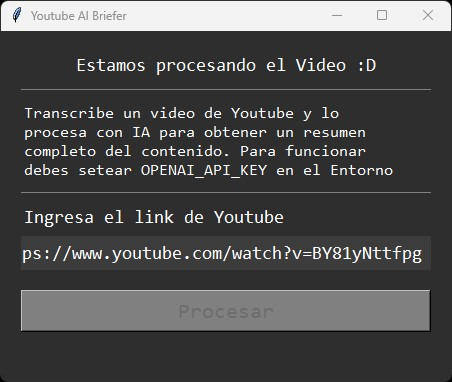
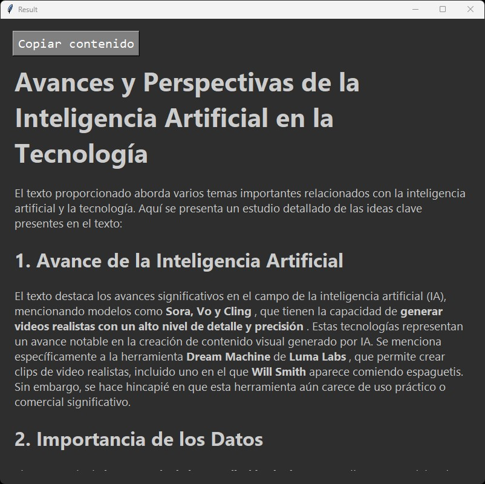

# Youtube AI Briefer #

Transcribe un video de Youtube y lo procesa con IA para obtener un resumen completo del contenido. Para funcionar debes setear `OPENAI_API_KEY` en el Entorno

Construida con Tkinter (multiplataforma)





## Googla Colab ##

Se incluye una version de Google Colab

## Funcionamiento ##

La aplicacion funciona obteniendo el transcript de un video de youtube y rompiendolo en secciones mas pequeñas analiza cada seccion y toma notas.

Luego toma todas las notas y las condensa en un solo documento que es el que se le muestra al usuario.

Para tomar las notas utiliza GPT-3.5 y para la condensacion GPT-4o

Aunque se puede pasar el texto completo a GPT-4, es mas caro. Ademas, si el texto es largo aumenta mas los precios debido a la gran cantidad de tokens de entrada.

Si es un texto de un video corto no importaria tanto pero si es un video largo es mejor condensarlo antes de pasarlo a GPT-4. Para el primer paso de condensar la informacion GPT-3.5-turbo es suficientemente inteligente y como es mas barato podemos reducir costos.

Asi solo le entregamos la informacion resumida a GPT-4 y este ejecuta solo el ultimo paso, con menos texto lo que resulta en costos reducidos.

Mezclar los modelos reduce costo porque la cantidad de token que procesa GPT-4 es bastante menor al tener la informacion resumida ya. Estamos hablando de un 70% menos de informacion que procesa GPT-4 por resumirla antes

## Calidad entre una sola tarea (1 paso) y preprocesar (2 pasos) ##

Obviamente el mejor resumen es utilizar GPT-4 para ambos pasos, resumir y procesar al final.

Un solo paso con GPT-4 y, por otro lado, preprocesar con GPT-3.5 y solo organizar con GPT-4 tienen resultados similares. Pero solo usar GPT-4 es mas caro

En Junio 2024, GPT-4 es aproximadamente 10x mas caro que usar GPT-3.5 pero tambien es aproximadamente 10x mas inteligente y logra resultados muchisimo mejores. Por lo tanto, es necesario a la hora de condensar la informacion resumida.

## Ambiente Desarrollo  ##

Se intento usar Poetry (https://python-poetry.org/) para manejar las dependencias de Python, pero finalmente se hizo sin Poetry (se puede completar en el futuro)

Instalar dependencias:

``` 
pip install pyinstaller youtube_transcript_api openai markdown2 tkhtmlview pyperclip 
```

Con esto ya se puede desarrollar en VS Code e iniciar el programa haciendo correr `main.py`

## Compilar a Ejecutable ##

Este comando creara un ejecutable en la carpeta `dist/`

```
pyinstaller -n "Youtube AI Briefer" --onefile --windowed --icon=assets/favicon.ico main.py
```

## Notas ##

### 06-2024 - LLM OpenSource ###
Se hicieron muchas pruebas con LLM opensource, Llama3, Phi, command-r y aya. Todos en general entregan resultados similares a GPT-3.5. Okay en el resumen y bastante deficiente a la hora de condensar la informacion.

En teoria se podria usar un LLM opensource para el paso de resumir, pero eso requeriria tener un servidor o cargar el modelo de forma local, que en maquinas lentas se comeria la performance